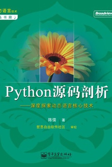
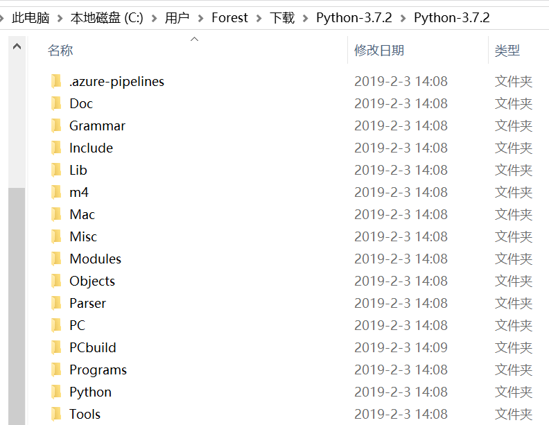
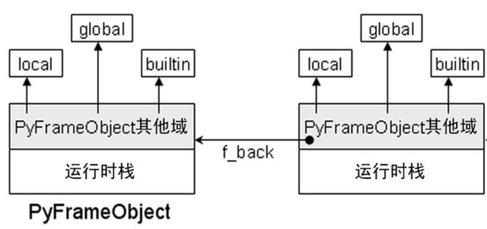
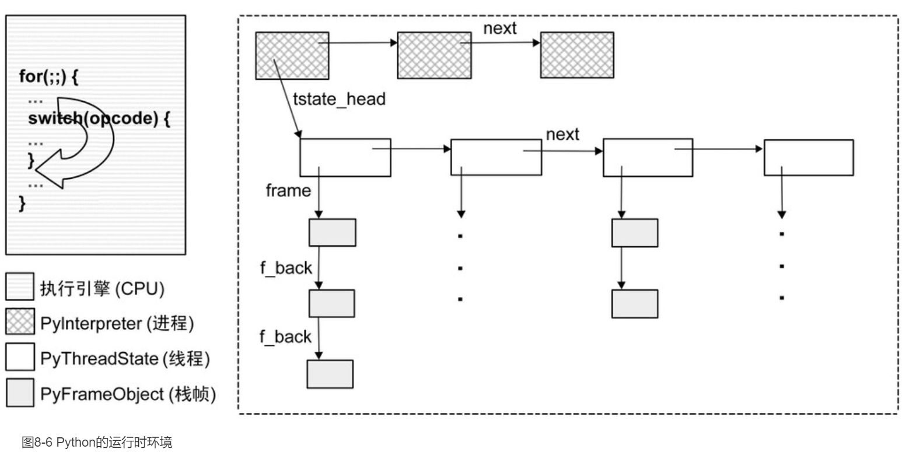
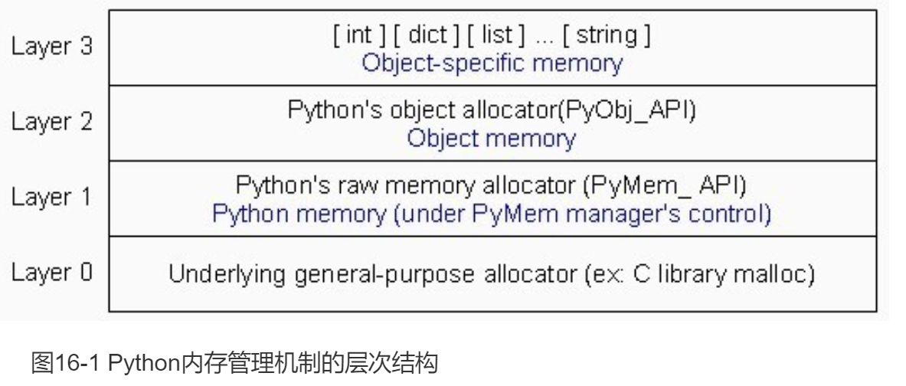

# Python源码剖析
## 参考内容
[Python源码剖析](https://read.douban.com/ebook/1499455/)

## 1. Cpython源码和架构
### 1.1 CPython总体架构
Cpython是python语言最常用的解释器，是用C语言编写的。
Cpython 3.7.2 源代码结构如下：

* Include: python 提供的所有头文件，如果用户需要用C/C++编写自定义扩展，需要用到这些头文件。
* Lib: python 自带的标准库，用Python语言编写。
* Modules: 包含所有用C语言编写的模块，这些模块对速度要求非常严格。
* Parser: Python解释器中进行词法和语法分析的部分。
* Objects: 包含所有python内建对象，例如：list，dict等。
* Python: 包含Python解释器中的编译和执行引擎，是python的核心。
* 
### 1.2 Cpython总体架构
总体架构包含三大块：
* File Groups: 核心Modules，公共库，用户自定义模块等。
* Python核心模块：Python解释器，包含Scanner，Parser，Compiler， Code Evaluator（就是执行器）。
* 运行环境：Object/Type 结构，内存分配器，current state of Python

***

## 2. Python对象
### 2.1 Python对象初探
python中，一切都是对象。整数，字符串，类型，函数等都是对象。
* python中， 对象的基石是PyObject类型

```c++
typedef struct _object {
    _PyObject_HEAD_EXTRA
    Py_ssize_t ob_refcnt;
    struct _typeobject *ob_type;
} PyObject;

PyObject_HEAD                   PyObject ob_base;
```
* 其他内置对象通常包含PyObject_HEAD内容，例如：
```c++
typedef struct {
    PyObject_HEAD
    double ob_fval;
} PyFloatObject;
```

### 2.2 整数对象
### 2.3 字符串对象
### 2.4 List对象
### 2.5 Dict对象

***
## 3. Python虚拟机
### 3.1 Code对象与pyc文件
* python 解释器在执行python程序时有一个编译过程，把python源码编译成pyc文件。类似java中的字节码文件（byte code）。
* python 虚拟机对字节码文件一条一条执行。依赖python37.dll（3.7版本）解释执行。
* python编译结果是PyCodeObject对象，这个PyCodeObject对象最终会写到pyc文件中。
```c++
[code.h]
typedef struct {
    PyObject_HEAD
    int co_argcount;        /* #arguments, except *args */
    int co_nlocals;     /* #local variables */
    int co_stacksize;       /* #entries needed for evaluation stack */
    int co_flags;       /* CO_..., see below */
    PyObject *co_code;      /* instruction opcodes */
    PyObject *co_consts;    /* list (constants used) */
    PyObject *co_names;     /* list of strings (names used) */
    PyObject *co_varnames;  /* tuple of strings (local variable names) */
    PyObject *co_freevars;  /* tuple of strings (free variable names) */
    PyObject *co_cellvars;      /* tuple of strings (cell variable names) */
    /* The rest doesn't count for hash/cmp */
    PyObject *co_filename;  /* string (where it was loaded from) */
    PyObject *co_name;      /* string (name, for reference) */
    int co_firstlineno;     /* first source line number */
    PyObject *co_lnotab;    /* string (encoding addr<->lineno mapping) */
    void *co_zombieframe /*for optimization only */
} PyCodeObject;
```
* co_code存放python的字节码指令序列。
* python文件中不同的名字空间称为一个code block，对应一个PyCodeObject，例如：一个函数，一个class等。
* pyc文件中的字节码样例如下：
    ```c++
    [declare.py]
    i = 1
    #   LOAD_CONST   0
    #   STORE_NAME   0

    s = "Python"
    #   LOAD_CONST   1
    #   STORE_NAME   1

    d = {}
    #   BUILD_MAP   0
    #   STORE_NAME   2

    l = []
    #   BUILD_LIST   0
    #   STORE_NAME   3
    #   LOAD_CONST   2
    #   RETURN_VALUE   none

    ```
### 3.2 python虚拟机框架
* pvm在执行pyc文件是，需要创建对应的可执行环境，类似c执行环境中所谓的栈结构等。
* PyFrameObject结构如下[frameobject.h]：
    ```c++
    typedef struct _frame {
        PyObject_VAR_HEAD
        struct _frame *f_back;  //执行环境链上的前一个frame
        PyCodeObject *f_code;   //PyCodeObject对象
        PyObject *f_builtins;   //builtin名字空间
        PyObject *f_globals;    //global名字空间
        PyObject *f_locals;     //local名字空间
        PyObject **f_valuestack;    //运行时栈的栈底位置
        PyObject **f_stacktop;      //运行时栈的栈顶位置
        ……
        int f_lasti;        //上一条字节码指令在f_code中的偏移位置
        int f_lineno;       //当前字节码对应的源代码行
        ……
        //动态内存，维护（局部变量+cell对象集合+free对象集合+运行时栈）所需要的空间
        PyObject *f_localsplus[1];  
    } PyFrameObject;
    ```
* 本质上pvm的执行环境就是在模拟类似x86机器上c执行环境的栈帧结构。当然，PVM的运行栈和x86中由操作系统构建运行栈是不同的，操作系统的构建的运行栈每个线程对应一个，由操作系统在程序执行前构建。pvm的pyc执行环境的栈区应该来自于系统堆，由pvm这个应用程序自行管理。对于python中全局变量和局部变量的理解，几乎和C/C++中的概念类似。

* python中赋值语句、函数定义，类定义， import 等都可以看做是“赋值语句”，需要创建对应的普通对象、函数对象、类对象、模块对象等，并且给变量赋值。即得到（name，object）这样一个关联关系。
* python中LEGB规则，本地、闭包、全局、内嵌变量名访问规则。
* PVM运行时环境初探：
    * python启动时对应操作系统的一个进程，相应状态信息保存在PyInterpreterState对象中，每个运行的解释器就是一个进程。
    * PVM使用操作系统原生线程来支持python语言的线程概念，其状态信息保存在PyThreadState对象中。
    * 多个线程 import 的module，属于共享数据，而不是各保留一份。
    * 线程同步使用GIL锁机制。
    ```c++
    [pystate.h]
    typedef struct _is {
        struct _is *next;
        struct _ts *tstate_head; //模拟进程环境中的线程集合

        PyObject *modules;
        PyObject *sysdict;
        PyObject *builtins;
        ……
    } PyInterpreterState;

    typedef struct _ts {
        struct _ts *next;
        PyInterpreterState *interp;
        struct _frame *frame; //模拟线程中的函数调用堆栈
        int recursion_depth;
        ……
        PyObject *dict;
        ……
        long thread_id;
    } PyThreadState;

    ```

### 3.3 虚拟中的一般表达式
### 3.4 虚拟机中的控制流
### 3.5 虚拟机中的函数
### 3.6 虚拟机中的类机制

***

## 4. Cpython的高级话题
### 4.1 Python运行环境初始化
* 
### 4.2 Python模块的动态加载
### 4.3 Python多线程机制
* python提供GIL作为全局锁来互斥不同线程对“解释器”的使用， python线程获得PVM解释器后执行100条pyc指令后，将强制挂起当前线程，切换到下一个处于等待状态的线程。下一个处于调度的线程完全由操作系统决定。
* python的GIL只用于pyc指令在执行时线程级别的切换，它依然受到系统线程切换的管控。他们不属于一个级别。
* python线程可以在指令执行完毕后被切换，也可以通过sleep主动或者其他条件下的被动线程切换，例如：通过sleep要求主动切换，通过I/O操作被动切换。在切换时需要先释放GIL。在sleep、I/O操作被动切换情况下， pyc指令执行计数器不会被重置为100（因为是他主动放弃一部分执行时间）。
* GIL级别的互斥可以看做python 内核级别的互斥，使得对python解释器，python提供的C API（python C扩展吧，我不确定）的访问时互斥的。在python线程之上的共享数据可以看做“用户级数据互斥”。这种需要使用常规的Lock锁机制。在获取Lock前先通过Py_BEGIN_ ALLOW_THREADS释放GIL，免得引发死锁。等获得用户级Lock之后，再通过Py_BEGIN_ALLOW_THREADS竞争获取GIL。
### 4.4 Python的内存管理机制
* pvm的内存管理机制，在c的内存库之上，通过自己提供的内存管理进行设计。结构如下：
 
* 可以这样理解：python在操作系统的c lib的基础上先从堆中申请一大段内存，用于构建pyc代码执行过程中所需要用到的各种高层python对象，例如：数字、list、tuple、map、class对象、function对象、module对象等。以及构建python解释器执行环境，例如：栈帧等。
* python对象包括栈帧在内一直使用的系统内存为“堆”内存。而PVM中针对pyc字节码之类的解释程序，采用的是c程序，其使用的系统内存有系统“栈”和系统“堆”。


***

**其他链接**
1. [暨南大学](https://www.jnu.edu.cn/)
2. [林龙新的教学网站](https://icerg.longxinlin.com)
3. [python官方网站](https://www.python.org)

**文档维护人名单：**

编号| 姓名  | 单位
----|-----|---
1|Forest Lin| Jinan University
2|Steven Lin| Middle School affiliated to Guangzhou University


