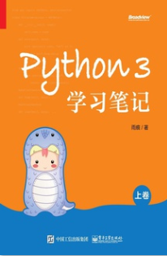
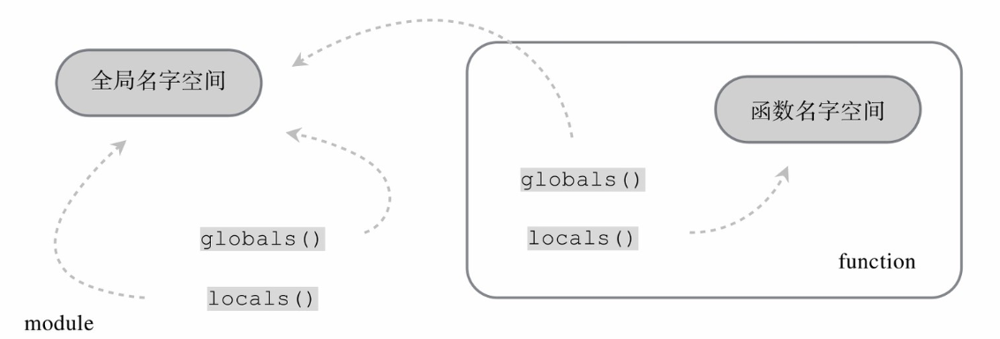

# Python3学习笔记
## 参考内容
[Python3学习笔记](https://book.douban.com/subject/28509425/)

## 1. 概述
* python诞生于1989年，迄今30年了。哈哈，没什么好说的。
* 一门胶水语言，代表一个生态链，尤其是在学术界。
## 2. 类型
* python： 完全面向对象 +  函数式编程， 动态语言。复杂程度比想象中高很多，因为太灵活，隐藏了很多细节。
* 万物皆对象，对象从属于一个“类”，python采用基于class的方式实现面向对象，javascript采用基于“原型”的方式实现面向对象。这说明，体现面向对象设计思想的设计方法不一定只有一种。
* python中的所有变量，其实是“指针”，指向每一个具体的对象。通过id()函数可以每个对象的标识， Cpython中用每个对象的内存地址作为其id值。type()函数用来返回实例所属的类型。判断一个实例是否属于一个特定的类，用isinstance函数。
* 面向对象主要三大特征：封装、继承和多态，python都可以很好的支持，python3 支持多继承。这个和java不同，和C++类似。通过issubclass来判断一个类是否另外一个类的子类或者子孙类。
* 所有类共有1个祖先类，即object
* 所有类型也只是个类型对象，它的类型是"type"。 type的类型是type，object的类型也是type。type的基类是object， object的基类没有。总结一下：python类的体系中，object是root类。 所有类型都是type类型的实例。type是type和object的实例。哈哈，太绕了。 type类型又称为 metaclass。
* 类型对象属于创建者的角色存在，由解释器首次载入时自动生成，生命周期与进程同步，而且属于“单例模式”。
* 变量名其实就是内存的别名， 在python中，任何变量等价于c/c++中的指针，当然在访问的时候采用类似C++引用的方式，和C++引用不同的是：C++中的引用初始化指向一个对象后，不可以再改变了，而python中的变量可以指向不同的对象。
* 动态语言中，名字和对象通常是两个运行期的实体。
```python
x = 100
x +=2  # 1. 准备好目标对象100 
       # 2. 准备好名字x（在python函数的栈帧中分配，栈帧属于系统的堆内存。
       # 3. 在名字空间中建立两者的练习 : namespace {x:100}
       # 4. 名字空间，namespace 是上下文环境中专门用来存储名字和目标引用关联的容器。
```
* 对python而言，每个模块（源文件）都有一个全局名字空间，根据代码作用域，例如：函数， 代码块{}， 又有当前名字空间和子名字空间说法，即嵌套的名字空间。名字空间默认使用字典数据结构以 key/value 的方式存储这种关联。 内置函数globals和locals分别返回全局名字空间和本地名字空间信息。
```python
def add(x, y):
    def yes(x1, y1):
        print(x, y)
        print(x1, y1)
        print("the locals of yes function:")
        print(locals())
        print("the globals of yes function:")
        print(globals())

    yes(15, 60)

    result = x + y
    print()
    print("the locals of add function:")
    print(locals())
    print("the globals of add function:")
    print(globals())


add(90, 100)

print("the locals of module")
print(locals())

print("the globals of module")
print(globals())
```
```
H:\my-workspace\python-workspace\python-study\venv\Scripts\python.exe H:/my-workspace/python-workspace/python-study/part1-basics/chap01.py
90 100
15 60
the locals of yes function:
{'x1': 15, 'y1': 60, 'x': 90, 'y': 100}
the globals of yes function:
{'__name__': '__main__', '__doc__': None, '__package__': None, '__loader__': <_frozen_importlib_external.SourceFileLoader object at 0x016CEE30>, '__spec__': None, '__annotations__': {}, '__builtins__': <module 'builtins' (built-in)>, '__file__': 'H:/my-workspace/python-workspace/python-study/part1-basics/chap01.py', '__cached__': None, 'add': <function add at 0x01E496A8>}

the locals of add function:
{'yes': <function add.<locals>.yes at 0x01E49858>, 'result': 190, 'x': 90, 'y': 100}
the globals of add function:
{'__name__': '__main__', '__doc__': None, '__package__': None, '__loader__': <_frozen_importlib_external.SourceFileLoader object at 0x016CEE30>, '__spec__': None, '__annotations__': {}, '__builtins__': <module 'builtins' (built-in)>, '__file__': 'H:/my-workspace/python-workspace/python-study/part1-basics/chap01.py', '__cached__': None, 'add': <function add at 0x01E496A8>}
the locals of module
{'__name__': '__main__', '__doc__': None, '__package__': None, '__loader__': <_frozen_importlib_external.SourceFileLoader object at 0x016CEE30>, '__spec__': None, '__annotations__': {}, '__builtins__': <module 'builtins' (built-in)>, '__file__': 'H:/my-workspace/python-workspace/python-study/part1-basics/chap01.py', '__cached__': None, 'add': <function add at 0x01E496A8>}
the globals of module
{'__name__': '__main__', '__doc__': None, '__package__': None, '__loader__': <_frozen_importlib_external.SourceFileLoader object at 0x016CEE30>, '__spec__': None, '__annotations__': {}, '__builtins__': <module 'builtins' (built-in)>, '__file__': 'H:/my-workspace/python-workspace/python-study/part1-basics/chap01.py', '__cached__': None, 'add': <function add at 0x01E496A8>}

Process finished with exit code 0
```
* 名字空间结论： 函数中的locals包含其内部定义的局部变量 + 从上层函数可见的局部变量， 函数中的globals就是指函数所在模块的globals；模块的locals和globals是一样的。

* 所以，可以通过修改名字空间来建立关联引用。例如： globals()["hello"] = "hello world!", 不过一般不建议这么做。
* 必须使用 is 来判定两个名字是否引用了同一个对象。
* 模块成员以下划线开头变量（例如 _x)，属于私有成员，不可以被 import * 导入，但是其实可以被 from xxx import _x 导入；class中以双下划线开始但无结尾的变量（__x), 属于自动命名私有成员；以双下划线开头和结尾（__x__）的成员，通常为系统成员，一般避免使用。在交互模式下，单下划线(_)返回最后一个表达式结果。
* 弱引用： weakref, 不改变被引用对象的引用计数值。创建一个弱引用， w = weakref.ref(a), 使用弱引用， w(), 采用函数式调用语法。可以使用proxy来保持和普通引用的使用方法一致性。例如： p = weakref.proxy(a), p.name = "hello"。
* 对象copy可以分为浅拷贝和深拷贝：copy.copy方法是浅拷贝， copy.deepcopy是深拷贝。浅拷贝只是复制引用，深拷贝会递归复制所有引用成员。
* 对象之间可能造成循环引用，例如： a.x = b, b.x = a。此时，释放对象将成为问题。
* python中变量的作用域遵循LEGB的访问方式。
## 3. 表达式
## 4. 函数
## 5. 迭代器
## 6. 模块
## 7. 类
## 8. 异常
## 9. 元编程
## 10. 进阶
## 11. 测试
## 12. 工具