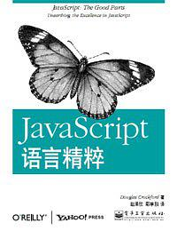

# Javascript语言精髓
## 参考内容
[Javascript语言精髓](https://book.douban.com/subject/3590768/)

## 1. good parts
* js的优秀想法：函数、弱类型、动态对象、对象字面量。
* 糟糕的想法： 基于全局变量的编程模式。
* js是第一个成为主流的 Lambda 语言。 它和 Lisp， Scheme有更多共同点。它是披着C外衣的Lisp。
* js基于原型继承，而不是基于类。对象从其他对象直接继承而来。它是“基于原型”的思想，面向对象不一定只有“基于类”的设计理念。
* 数据对象、函数本质上都是对象。
## 2. 语法
* 标识符和其他编程语言类似，被用于语句，变量，参数，属性名，运算符和标记等。
* 标识符不能是一些关键词，例如：undefined， NaN， Infinity。
* JS 只有一个数字类型，在内部就是64位的浮点数，和java的double一样。1 和 1.0 是相同的。NaN是个数值，不产生正常结果的运算结果。 Infinity模拟无穷大。
* 字符串中的字符是16位unicode的。js没有字符类型，可以用只包含一个字符的字符串替代。
* \<script\>标签提供一个编译单元， 因为缺少连接器，js直接把他们抛到公共的的全局名字空间。
* var语句可以定义函数的私有变量，{}代表代码块，js函数中的代码块不会创建新的作用域，因此，变量应该被定义在函数的头部，而不是代码块中。
* 下面的值被当作判断条件中的falsy： false, null, undefined, "", 0, NaN。其他所有值被当作真。
## 3. 对象objects
## 4. 函数
## 5. 继承
## 6. 数组
## 7. 正则表达式
## 8. 方法
## 9. 代码风格
## 10. 优美的特性