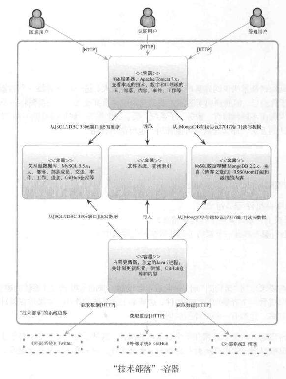
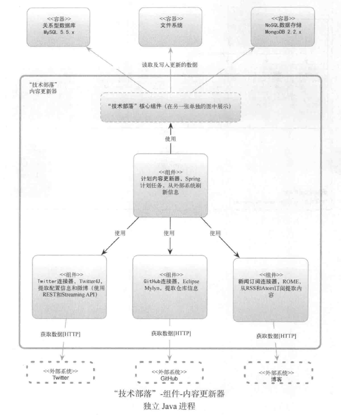
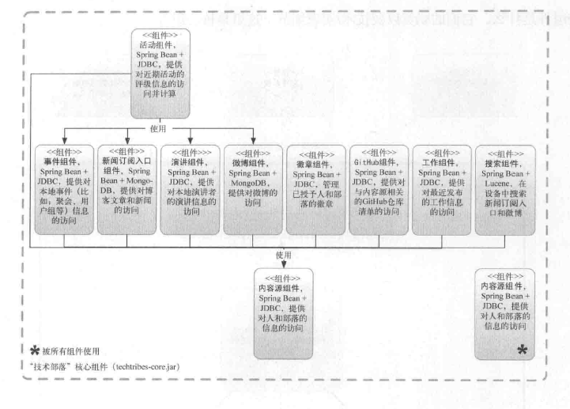
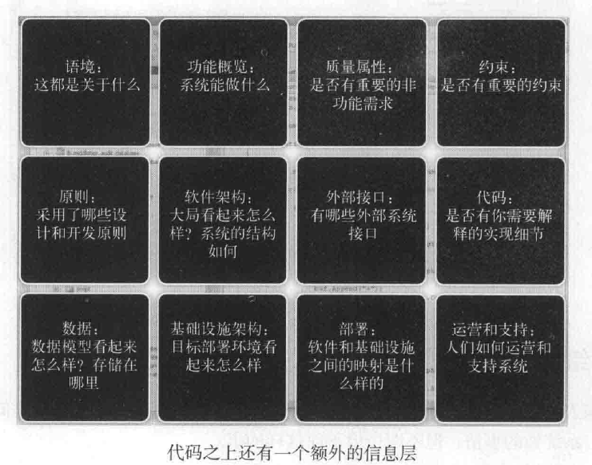

# 程序员必读的软件架构
## 参考内容
[程序员必读之软件架构](https://book.douban.com/subject/26248182/)

## 什么是架构
* **作为名词**。与结构有关，需要将产品分解为一系列组件、模块和交互。
* **作为动词**。理解你需要构建什么、设定愿景便于进行构建和做出恰当的决策设计。

## 架构的种类
* 各种领域系统的架构包含两部分内容：***结构*** 和 ***愿景***。

## 架构是什么
* 应用程序架构：结构以软件为基础，包括编程语言和结构、类库、框架和API等。由类、组件、模块、函数、设计模式等描述，重点考虑**软件和代码**组
织。
* 系统架构：系统架构以软、硬件为结构单元。描述从组件和服务到子系统更高层次的抽象。
* 软件架构：软件架构 = 应用程序架构 + 系统架构的结合。
* 企业架构：企业部门分组结构，是更高层次的抽象，关乎战略而非代码。

## 敏捷软件架构是什么
* 好的架构带来敏捷，而不是敏捷代理好的架构。

## 架构和设计
* 设计：一个系统内部命名的结构或行为，解决或有助于解决该系统中的一个或多个问题，因此，设计代表了潜在的决策空间的一个点。
* 所有架构都是设计，而不是所有设计都是架构。
* 架构反映了使一个系统成型的重要设计决策，而重要性则通过改变的成本来衡量。
* 本质上，重要决策即“架构”，其他则是“设计”。

## 软件架构重要吗？
* 缺乏软件架构会引起一系列的问题
* 软件架构带来的好处：
    + 让团队跟随一个清晰的愿景和线路图
    + 技术领导力和更好的协调
    + 识别与减轻风险的框架
    + 方法和标准的一致性，带来结构良好的代码库
    + 对不同的听众，以不同层次的抽象来交流解决方案的结构
* 所有软件项目都需要“软件架构”

## 软件架构的角色
* 可以是一个人，也可以是一个团队
* 主要的角色扮演：
    + 架构驱动力：理解目标，抓住、提炼和挑战需求和限制
    + 设计软件：建立技术战略，愿景和路线图
    + 技术风险：发现，减轻和承担技术风险，保证架构的运转
    + 架构演化：贯穿整个软件交付过程，持续的技术领导和对架构的承担
    + 编写代码：参与到软件交付的实践部分
    + 质量保证：引入并坚持标准，指导和原则等。

## 软件架构师应该编码？
* 编码应该成为架构师工作的一部分
* 构建系统原型、框架和基础
* 进行代码评审
* 实验并与时俱进
* 你不必放弃编码：软件架构师在满足非功能性需求，进行技术质量保证等方面要承担很大的责任。编码时保证项目成功最好的方式之一。
* 不要把全部时间都用于编码

## 从开发者到架构师
* 开发者：为一个软件系统的架构出力
* 架构师：为一个架构负责

## 架构师的拓展技术
* 知识面要宽
* 通才型专家
* 是技术活

## 其他软技能
* 领导力、沟通力、影响力、信心、合作、指导、动力、责任感等。
* 保持积极

## 软件架构不是接力运动
* 架构师要负责全局，而不是提供了一个愿景和架构之后，而不继续为系统负责。

## 软件架构要引入控制？
* 肯定。提供指导，追求一致性
* 从部分控制开始，倾听反馈。

## 每个人都是架构师
* 敏捷软件需要架构

## 架构驱动力
* 功能需求
* 质量属性：重要的非功能性需求，如性能、可伸缩性、可用性、安全性等。
* 约束
* 原则，例如：编码规范、自动化测试的使用，架构的分层
* 理解影响：软件架构讨论的是重要的设计决策

## 质量属性
* 性能：响应时间、延迟等
* 可伸缩性：和并发机制密不可分
* 可用性：5个9的可靠性
* 安全性：和网络安全有关，例如,OWASP
* 灾难恢复
* 可访问性，例如：让视觉障碍的人使用系统等。
* 监测：系统状态的整体监控
* 管理
* 审计，例如：日志系统等
* 灵活性
* 可扩展性
* 可维护性，代码库和系统将来由谁来维护。
* 法律法规
* 国际化
* 本地化

## 处理非功能需求
* 捕捉
* 提炼
* 挑战，采用成本法来分析。

## 约束
* 时间和预算约束
* 技术约束：批准的技术清单、系统的互操作性、目标部署平台、open source集成、内部知识产权等。
* 人员约束：人数、技能等。
* 组织约束

## 原则
* 开发原则：编码规范和标准、自动化但与测试、静态分析工具
* 架构原则：分层策略，业务逻辑的位置，高内聚、低耦合、SOLID原则等，无状态组件，存储过程，域模型等。

## 软件架构是对话的平台
* 软件架构并非孤立的，软件设计过程是一个交流平台。

## 无效的草图
* 可视化的重要性：
    + 很多软件团队为敏捷而敏捷，把精华和糟粕一起扔了：建模和文档随着传统的计划驱动的过程和方法一起扔了。
    + 看不到文档和图表价值的团队，抛弃了UML，使用更轻量和务实的方法。
    + 很少有人教如何有效的可视化

## C4：语境、容器、组件和类
* 通用的抽象集合：软件架构是关乎结构、愿景的，软件结构一定由一些元素构成
    + 如果使用OOP的编程，软件系统则由多个容器构成、容器由多个组件构成、组件由多个类构成。
    + 类：系统软件的最小结构单元
    + 组件：一个和多个类组成的逻辑群组
    + 容器：指一个可执行组件和驻留数据的东西，通常是可执行文件，任何容器间的通信需要一个远程接口。
    + 系统：由多个独立的容器构成。
* 软件的静态视图
    + 语境图：设定场景的高层视图，包括关键的系统以来和参与者
    + 容器图：显示高层次的技术选择，容器如何分担职责、如何通信。
    + 组件图：看清每个容器的关键逻辑组件和他们之间的关系
    + 类图：组件的类组织图。

## 语境图
* 意图：系统是什么？ 谁会用它？ 如何融入已有的IT环境？
* 结构：中间的框图是你的系统，周边是其他用户和所以来的IT系统。
* 用户和人物等：业务用户，管理用户
* IT系统：不同的第三方系统
* 交互：用些简单文字对本系统和其他外部系统的交互进行一些提示。
* 动机：语境图是其他图的起点，其实，类似UML中的用例图、部署图等。

## 容器图
* 意图：
    + 系统的整体形态是什么？
    + 高层次技术决策有哪些？
    + 职责在系统中如何分布？
    + 容器间如何相互协作？
    + 作为一个开发者，在那些地方写代码？
* 结构：用简单的框图，增加些系统的语境内容。
* 容器
    + 指组成软件系统逻辑上的可执行文件或者过程，例如：Tomcat，Weblogic，ESB，SQL数据库，NoSQL，独立应用程序
    + 针对容器：名称、技术、职责
* 交互：指容器间的通信技术，通常一个容器是一个进程，所以，其交互往往就是进程间通信。
    + 交互的目的（如，读写数据，发送报告等）
    + 通信方法（例如，REST，WebService， JMI， RPC等）
    + 通信方式（同步、异步、批量等）
    + 协议和端口号（HTTP，HTTPS，SOAP/HTTP，SMTP，FTP等）
* 系统边界
    + 本系统和语境中其他外部系统之间的边界
* 动机
    + 语境图把系统看成个盒子，而容器图则打开了这个盒子，把这个盒子用多个容器和容器之间的关系进行刻画
    + 便于让高层技术的选择更加明确
    + 展示容器之间的关联，以及它们之间如何沟通等
    + 提供了一个放置组件的框架，就是说所有的组件有个家
* 受众
    + 团队开发人员和外部技术人员，以及相应的运维人员。
* 示例
    + 一个“技术部落”系统的容器图
    + 

## 组件图
* 意图
    + 系统由哪些组件/服务组成？
    + 在高层次上，系统如何工作是否清晰？
    + 所有组件/服务都有一个家？
* 结构
    + 一般是只驻留在单个容器中的组件图，当然也可以是整个系统的组件图
* 组件
    + 系统粗粒度结构单元，使得设计者理解1个或者多个组件实现一个用力/故事的特性
    + 内容：组件名称、技术选择（例如：Java对象、EJB等）、职责
* 交互
    + 交互的目的
    + 通信方式
* 动机
    + 展示了驻留在容器中的逻辑组件
    + 展示了高层次上你的系统软件分解为职责的不同部分
    + 展示了组件之间的关系和依赖等
    + 为软件开发的高层次预估和如何分解提供了一个框架
* 受众
    + 软件开发团队的开发人员
* 实例：

    

## 软件架构和编码
* 软件架构到编码的映射方法
    + 用层封装代码
    + 用特性封装（就是用垂直的功能来封装）
    + 用组件来封装。其实就是微服务。
    + 建议使用以组件来封装的映射方式作为基本原则。

## 你不需要UML
* 现实工作中并不一定真正的大量使用UML，可以更多使用非正式的图
* 流程和工作流：简单的UML活动图可以使用
* 运行时行为：UML序列图和协作图非常合用
* 域模型：使用UML的类图
* 模式和原则：UML类图很合适
* 状态图表：UML状态图
* 部署：UML部署图非常棒
* 总结：
    + C4模型：语境图、容器图、组件图、类图主要展示系统的静态特性
    + 上述UML很多图可以方便表达系统的动态行为
    + 是否使用UML并没有确定答案，你不需要使用UML工具来做架构和设计，但是它们有很多用途。

## 有效的草图
* 内容
    + 标题
    + 标签
    + 形状：线、框、圆柱体等
    + 职责：实体本身的任务
    + 线条：实线、虚线、方向等的用途
    + 颜色
    + 边框
    + 布局
    + 方向
    + 图表的评审清单

## 软件文档
* 有必要，因为代码不会讲述完整的故事
* 在代码之外，系统还有很多问题需要回答

## 软件文档就是指南
* 应该包含以下内容
    + 语境
    + 功能性概览
    + 质量属性
    + 约束
    + 原则
    + 软件架构
    + 外部接口
    + 代码
    + 数据
    + 基础设施架构
    + 部署
    + 运营和支持
    + 决策日志
## 软件指南的编写
* 语境
    + 意图
    + 结构，使用语境图
    + 动机
    + 受众：直接开发软件的团队内外的技术和非技术人员
    + 是否必须：是
* 功能性概览
    + 意图：主要是功能，解决什么问题
    + 结构：UML用例图、简单的线框图展示比较合适
    + 动机
    + 受众：直接开发软件的团队内外的技术和非技术人员
    + 是否必须：是
* 质量属性
    + 意图
    + 结构：直接列出各种质量属性比较好
    + 动机：说明原因
    + 受众：主要针对技术团队中的技术人员
    + 是否必须：是
* 约束
    + 意图
    + 结构：直接列出各种约束
    + 动机
    + 受众：参与软件开发过程中的每一个人
    + 是否必须：是
* 原则
    + 意图
    + 结构：直接列出各种原则，例如， 架构分层策略、始终使用ORM、SOLID原则、不要重复发明轮子等
    + 动机
    + 受众： 主要是软件开发团队的技术人员
    + 是否必须：是
* 软件架构
    + 意图
    + 结构：使用容器、组件图作为重点来描述
    + 动机
    + 受众
    + 是否必须：是
* 外部接口
    + 意图
    + 结构：列出各种接口、并描述它，在容器图和组件图中展示它
    + 动机
    + 受众
    + 是否必须：不是，只有当构建的东西有一个或更多复杂接口，才用。
* 代码
    + 意图：描述系统中重要的、复杂、意义重大的实现细节
    + 结构：保持简单
    + 动机
    + 受众：主要是开发团队的技术人员
    + 是否必须：不是，但除了不重要的软件系统，一般包含它。
* 数据
    + 意图：数据模型，数据相关内容
    + 结构：域模型、ER图等
    + 动机
    + 受众
    + 是否必须：不是，但除了不重要的软件系统，一般包含它。
* 基础设施架构
    + 意图：和部署有关
    + 结构：使用部署图或者其他基础设施系统图
    + 动机
    + 受众：技术人员、部署和运维人员
    + 是否必须：是
* 部署
    + 意图：容器、组件、基础设施之间的映射
    + 结构：表格、图表
    + 动机
    + 受众：技术人员、部署和运维人员
    + 是否必须：是
* 运营和支持
    + 意图
    + 结构：叙事性的
    + 动机
    + 受众：技术人员、部署和运维人员
    + 是否必须：是
* 决策日志
    + 意图：重要决策相关日志信息
    + 结构：文字描述
    + 动机
    + 受众
    + 是否必须：不是，通常建议撰写。

