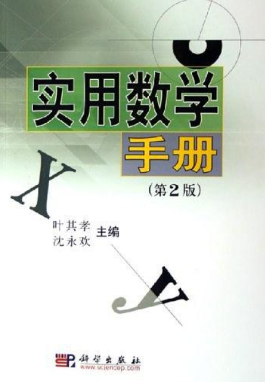

# 实用数学手册(第2版)
## 参考内容
[实用数学手册(第2版)](https://book.douban.com/subject/1505256/)

## 1. 初等代数
* 数系主要包含实数、复数。实数分为有理数和无理数，虚数分为纯虚数和非纯虚。数。N、Z、Q、R、C代表全体自然数、全体整数、全体有理数、全体实数、全体复数。
* 数的基本运算规律：交换律、结合律、分配律。（假设规则是+，其实可以考虑任意运算规则）
* 指数、对数等都是数系按照运算规则后的更复杂的表现形式。
* 针对复数，类似实数定义了其和、差、积、商、幂等。
* 一元多项式定义：多个系数和1个变量， 系数必须是“域”，变量x可以是任意集合的元素，如果系数属于实数域，则成为实系数多项式。多项式对加法和乘法满足：交换律，结合律，分配率，消去律。
* 代数基本定义：每个次数不小于1的复系数多项式，在复数域至少有1个根。但是考虑的代数只包含实数系和复数系，所以称之为代数基本定理。
* 二、三阶行列式和代数方程，当时出现行列式就是为了解方程用的。当然，最开始的行列式比较简单只有二、三阶。

## 2. 初等几何
* 研究形状，由体->面->线->点构成。面有曲面，现有曲线。
* 欧几里得几何就代表了初等几何。通过5条公理推出了一堆定理。
* 出现了一系列初等几何的公式。

## 3. 三角学
* 平面三角：把三角关系放到为二维笛卡尔系中进行性质的研究，得出一系列的结论。建立了三角函数，并研究了三角函数的各种性质。
* 球面三角：属于球面几何的一部分，属于非欧式几何。把平面三角的理论推广到球面，球面大圆 = 直线， 球面夹角，球面三角均有所不同。

## 4. 解析几何
* 笛卡尔直角坐标系： 在平面和空间中建立笛卡尔直角坐标系来研究几何。
* 曲线和曲面方程：为笛卡尔直角坐标系上的曲线或者曲面建立的代数方程。
* 参数方程：平面或者空间曲线上的点坐标，例如（x,y), (x,y,z)是某个参变量的函数，例如x(t), y(t), z(t)。则这叫做参数方程。生活中，人们在时间t上的活动轨迹可以用参数方程描述。
* 平面上的直线： 通过研究其直线方程来研究它的性质。
* 二次曲线：直线方程的次数为2， 例如：圆，椭圆等。椭圆可以用：标准方程和参数方程来刻画。
* 直角坐标和极坐标：可以把直角坐标化为极坐标，这样可以简化问题。
* 用到的特征方程， 不理解啊。

## 5. 线性代数
## 6. 微积分
## 7. 复变函数
## 8. 常微分方程和动力系统
## 9. 偏微分方程
## 10. 微分几何
## 11. 积分方程
## 12. 变分法
## 13. 概率论
## 14. 近世代数
## 15. 向量和张量分析
## 16. 积分变换
## 17. 特殊函数
## 18. 科学计算
## 19. 组合论
## 20. 图论
## 21. 随机过程
## 22. 数理统计
## 23. 运筹学
## 24. 控制理论
## 25. 最优化方法
## 26. 数学建模
