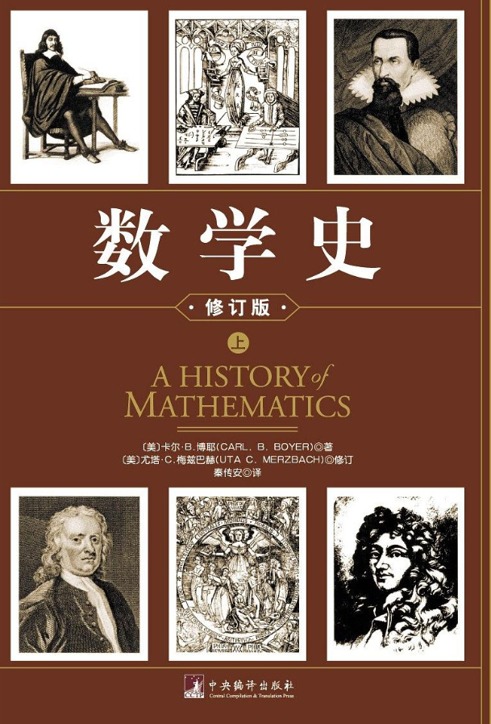

# 数学史(修订版)
## 参考内容
[数学史(修订版)](https://book.douban.com/subject/10732014/)

## 1. 起源
* 纯数学是从19世纪之后才开始从自然观察所要求的局限解放出来的。一直以来，数学和生活息息相关。
## 2. 埃及
* 出现了整数、比例数（就是有理数）
* 然后，出现了运算，主要是加法、以及多倍加法（就是乘法）
* 大部分是算术，当用题目不涉及具体的对象之后，这样的数学就是代数了。
* 开始出现代数方程。
* 几何萌芽。主要还是算术，埃及数学没那么神奇。
## 3. 美素不达米亚
* 就是古巴比伦文明，公元前4000年左右。
* 文字、轮子和金属得到了使用。
* 出现位置计数法。
* 以60为底的分数出现了，出现了二次方程的求解。也出现了三次方程。
* 多边形的面积。
## 4. 毕达哥拉斯学派
* 公元前6世纪的标志性人物，泰勒斯和毕达哥拉斯
* 泰勒斯定义：半圆的内接角是直角，主要涉及到几何
* 毕达哥拉斯：和孔子、佛陀、老子同时代的人。
* 毕达哥拉斯学派：万物皆数
* 几何原本的前两卷被认为是毕达哥拉斯的贡献。
* 