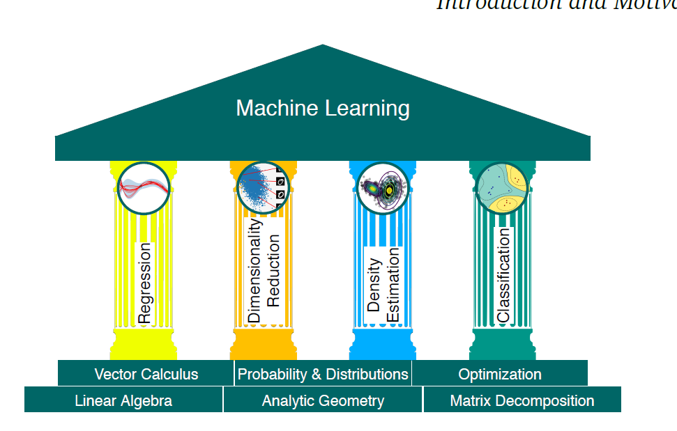

# 机器学习的数学基础
## 参考内容
[1] mathmatics in machine learning

## 0. 前言
* ML中的3个核心概念： 数据、模型、学习
* ML中把数据用向量表示。
* 通过随机或者优化方法选择一个模型
* 通过学习优化模型，实现参数评估和优化
  
  
## 1. 线性代数(Linear Algebra)
**基本概念**
* 向量是一些特殊的对象，它们对加法和标量乘法封闭。
* 
* 测试一下。 